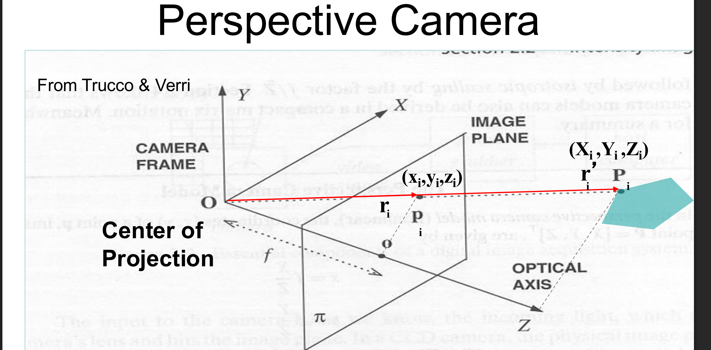
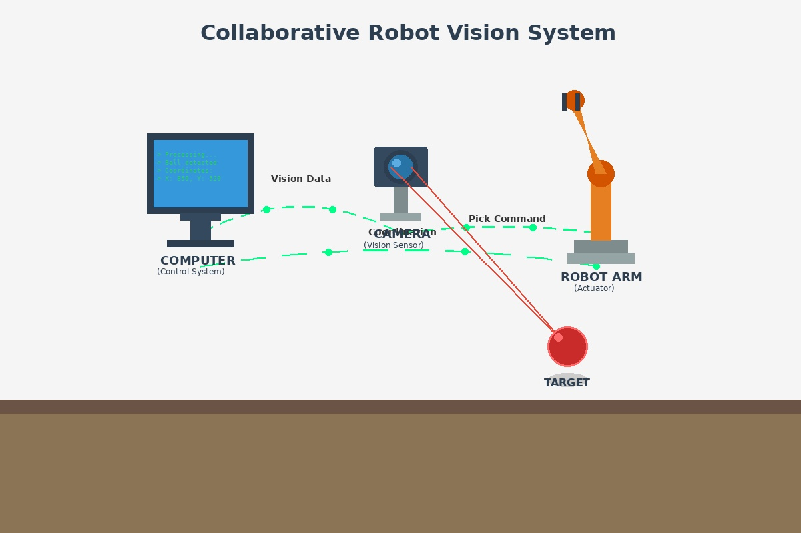
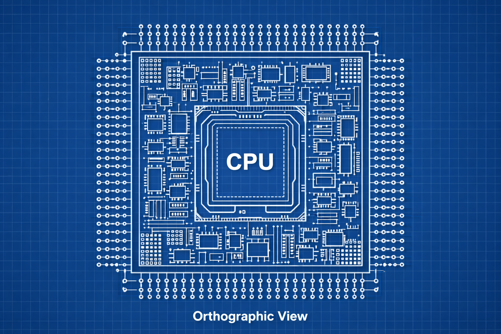

## Start
An image is a 2d projection of a 3D world. 

## Camera Frame

p is the point on the image plane, r is in the camera frame.
For example, assume the origin of the image plane is located at pixels (0,0) at the lower left hand corner(before plane inversion). point p is then  the sum of two vectors -- the vector from origin of the image plane to o lets call it v, and the vector from o to p lets call it p. Assume point o is located at on the image plane(approximatelythe middle point) which corresponds to $(0,0, Z_i)$ in the camera frame, and thus we can solve for the vector $r_i$(in the picture red arrow from camera frame origin to $r_i$) with the following: $r_i = (p_x-v_x,p_y-y_x,Z_I)=(x_i,y_i,z_i)$ in the camera frame. Note $r_i$ is still the 2D point on the image plane represented in the camera frame.

## Perspective Model(pinhole)
Perserves lines between 3d and 2d projections, but does not preseve angles or distances(due to Z).

Formula:(lowercase variables are 2d points, uppercase are 3d points) 
* x=X*(f/Z) (non linear transformation due to Z)(f is focal length-distance between O(camera frame origin and image plane)). You can solve for the 3D points by isolating big X or big Y, in these formulas.
* m=f/Z (m is the magnification)(all points on plane Z_i have same magnification)

### why do we care ?
Perspective projections connects 3D geometry to 2D images in a way that matches human vision and real cameras. In other words, it gives us a common language between the computer, the image and the 3d world we live in. This has many uses cases such as reconstructing 3D scenes, estimating camera pose, computer graphics and more. For example, lets say we have a computer that controls a camera and a robot arm. We can use the camera to take images, and run an algorithm on that image to find points of interest. We can then use another algorithm(which implements our perspective project formulas) to solve for the corresponding 3D points in the real world. Since we now have the 3D points, we can send instructions to the robot arm to interact with these points as we see fit. 
   

### The downfalls of perspective projection
What we will notice with the formulas above, is that we do not have a formula for Z(Z information is lost in projection). This means, that if we are to successfully use these formulas we must either measure them ourselves(yikes), or figure out another way to compute these values. Below we will cover weak perspective, which is an approximation to the perspective model that attempts to get around this issue. 

## Weak Perspective
An approximation to the perspective model, can be used if the average Z(for all 3d points) is large, but the point to point distances measured along the Z axis are much smaller. 
Formula: x = X*(f/$\bar{Z}$),  where $\bar{Z}$ is the average distance. This formula is linear, since Z which is the what makes the perspective model non-linear is removed and replaced with constant $\bar{Z}$. Downsides: 1. still have to solve for or approximate(or measure) $\bar{Z}$, 2. not a general solution since this approximation doesn't work for all possible scenes.

## Orthographic Projections 
An orthographic projection maps 3D points to 2D using parallel projection rays.

- All rays have the same direction
- No single center of projection
- Object size does not depend on depth

---

### Mathematical form

For a point (X, Y, Z):

x = sX, y = sY

Depth Z is ignored.

---

### Everyday and technical examples
Engineering & design
- Blueprints (front, top, side views of a building)
- Mechanical drawings (machine parts with exact dimensions)
- CAD models shown in “ortho” view

Manufacturing & inspection
- PCB inspection images (components measured independent of height)
- Dimensional metrology using telecentric cameras

Robotics & mapping
- Top-down occupancy grids
- 2D maps of robot workspaces
- Floor plans used for navigation

Graphics & visualization
- Isometric drawings (rotated orthographic views)
- Orthographic cameras in CAD and game engines
- Mini-maps in games

---

### Why these use orthographic projection

All of these require:
- True scale (no shrinking with distance)
- Parallel edges stay parallel
- Measurable distances

Perspective distortion would break measurements.

---

### Physical realization

- Achieved optically with telecentric lenses
- Approximated by long-focal-length cameras
- Implemented mathematically in graphics pipelines

## Parallel Lines in 3D

### 1. Parametric form of a 3D line

A line in 3D can be written as:

L(λ) = P0 + λ d,   λ ∈ ℝ

Where:
- P0 = (X0, Y0, Z0) is a point on the line
- d = (dX, dY, dZ) is the direction vector
- λ is a scalar parameter that moves along the line

Interpretation:
- λ = 0 gives the starting point P0
- λ > 0 moves along the direction vector d
- λ < 0 moves opposite to the direction

### 2. Condition for parallel lines

Two lines L1(λ) = P1 + λ d1 and L2(μ) = P2 + μ d2 are **parallel** if their direction vectors are proportional:

d1 = k * d2,   k ≠ 0

- The lines do not need to share a point
- They may be skew (not intersecting) or coincident (overlapping)

### 3. Component-wise representation

A line can also be written as:

x = X0 + λ dX  
y = Y0 + λ dY  
z = Z0 + λ dZ  

Two lines are parallel if their direction vectors (dX, dY, dZ) are proportional.

### 4. Analogy to 2D
- In 2D, lines are parallel if they have the **same slope** m = Δy/Δx
- In 3D, lines are parallel if they have **proportional direction vectors**
- The direction vector generalizes the idea of slope to three dimensions

### Figure Out 
How to tell if two lines are perpendicular(aka orthogonal)? 

## Vanishing points
**What:** Parallel lines in images appear to converge due to depth(Z axis) being inversely proportional to magnification. The vanishing point is where the parallel line appear to meet(converge) on the image plane.

**Why:** Helps us solve for the cameras extrinsic parameters(rotation) of a camera.
Gives us some insights on the Z axis of the 3D scene that we can use.  

**Limitations:** If a set of 3D parallel lines is parallel to the camera’s image plane, then their vanishing point lies at infinity, and no finite vanishing point can be computed.

## Other 
* ccd and cmos, are photosensitive semiconductors that measure(by converting to electrical signal) and store light, which can be shown in diodes. 

