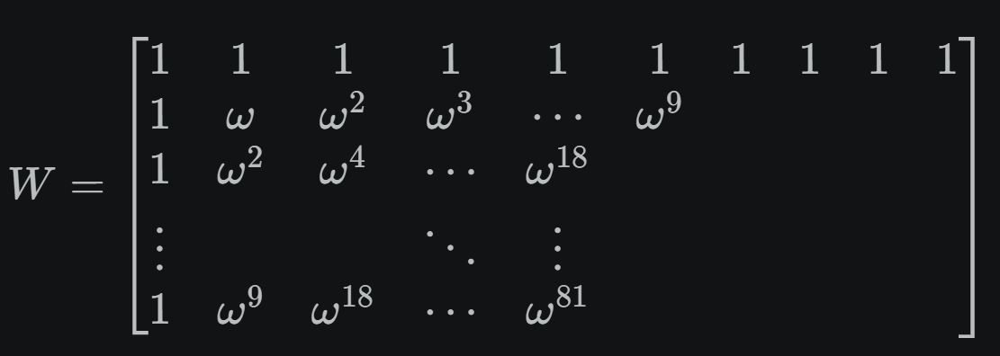
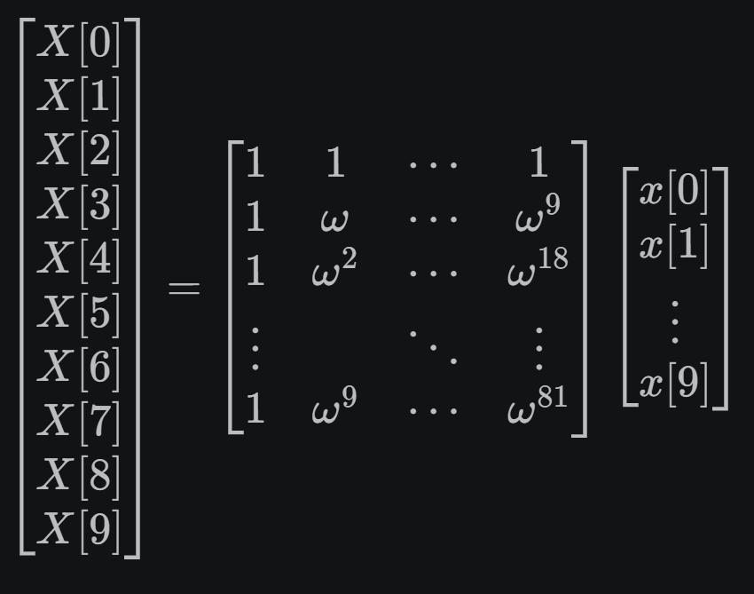

# Fourier Transforms

## Euler's Identity

Euler's Identity is:

$e^{jθ} = cosθ + j*sinθ$

Special case (Euler's identity proper):

$e^{jπ} + 1 = 0$

- Links the 5 fundamental numbers: 0, 1, π, e, j
- Shows the connection between exponentials, trig, and complex numbers

Using Euler's formula, any sinusoid can be written as:

$sinθ = \frac{e^{jθ} - e^{-jθ}}{2j}$  
$cosθ = \frac{e^{jθ} + e^{-jθ}}{2}$

---

## Conversion 
Convert:

$f(t) = \sin(2\pi \cdot 5t) + 0.5 \cdot \sin(2\pi \cdot 20t)$

Using Euler's formula:

### 1. First term

$\sin(2\pi \cdot 5t)$

$= \frac{e^{j 2\pi 5t} - e^{-j 2\pi 5t}}{2j}$

---

### 2. Second term

$0.5 \cdot \sin(2\pi \cdot 20t)$

$= 0.5 \cdot \frac{e^{j 2\pi 20t} - e^{-j 2\pi 20t}}{2j}$

$= \frac{e^{j 2\pi 20t} - e^{-j 2\pi 20t}}{4j}$

---

### Combined

$f(t) =$  

$\frac{e^{j 2\pi 5t} - e^{-j 2\pi 5t}}{2j} + \frac{e^{j 2\pi 20t} - e^{-j 2\pi 20t}}{4j}$

- Now $f(t)$ is expressed as a sum of complex exponentials  
- This is the form used in Fourier analysis
---

## Understanding waves

Given: $f(x) = A \sin(\omega x + \phi) + c$

Term meanings:

* A    : Amplitude – peak height of the wave
* ω    : Angular frequency – how fast the wave oscillates, ω = 2π*f
* x    : Input variable (usually time t)
* φ    : Phase shift – horizontal shift of the wave
* c    : Vertical offset – moves the wave up/down

Example:

$f(x) = 3 \sin(2\pi \cdot 10x + \frac{\pi}{4}) + 2$

- Amplitude = 3 → wave peaks ±3 from baseline  
- Angular frequency = 2π*10 → frequency = 10 Hz  
- Phase shift = π/4 → wave shifted right by π/4 radians  
- Vertical offset = 2 → baseline at 2 instead of 0

---

## Fourier Transforms
A **Fourier transform** is a way to break down a signal (like a sound wave, image, or time-series data) into a combination of simple waves (sines and cosines). Think of it as answering this question: *“What frequencies make up this signal?”*  

Any complex signal can be represented as a sum of simple oscillations:

- Low frequency → slow changes  
- High frequency → rapid changes  

For example:
- A musical chord = multiple pure tones added together  
- The Fourier transform tells you *which tones* are present and *how strong* they are  

---

## Time domain vs Frequency domain
- **Time domain**: how a signal changes over time (what you usually see)
- **Frequency domain**: what frequencies exist in the signal

The Fourier transform converts:

time domain → frequency domain

---

## The formula
Here’s the continuous Fourier transform:
$X(f) = \int_{-\infty}^{\infty} x(t) \, e^{-j 2 \pi f t} \, dt$
- $x(t)$: original signal (time domain)  
- $X(f)$: frequency representation  
- $e^{-i 2 \pi f t}$: complex sinusoid (basis function)

---

## What it’s really doing
You can think of it like this:

1. Take a sine wave of a certain frequency  
2. Compare it with your signal  
3. Measure how much of that frequency is present  
4. Repeat for all frequencies  

---

## Discrete version (what computers use)
In practice, we use the **Discrete Fourier Transform (DFT)** or the faster version:

- **FFT (Fast Fourier Transform)** → efficient algorithm

Used everywhere in:
- Audio processing (MP3s, speech recognition)
- Image compression (JPEG)
- Signal filtering
- Robotics & sensors
- **Computer vision** (image filtering)

---

## Example
Imagine a signal:

$f(t) = sin(2π·5t) + 0.5·sin(2π·20t)$

Fourier transform result:
- Peak at 5 Hz (strong)
- Peak at 20 Hz (weaker)

---

## Inverse transform
You can also go back:
$x(t) = \int_{-\infty}^{\infty} X(f) \, e^{j 2 \pi f t} \, df$

- Frequency → time domain  
- This is called the **inverse Fourier transform**

---

## Simple analogy
Think of a smoothie:
- Time domain = the smoothie  
- Frequency domain = the ingredients (banana, strawberry, etc.)  

Fourier transform = figuring out the recipe 

---

## Fast Fourier Transform (FFT)

The **Fast Fourier Transform (FFT)** is an efficient algorithm for computing the **Discrete Fourier Transform (DFT)**.

In simple terms:  
It does the *same thing* as the DFT—but **much faster**.

---

## What problem it solves
The DFT takes a signal with N samples and computes its frequency components.

Naively:
- DFT complexity = $O(N^2)$ → slow for large data

FFT improves this to:
- O(N log N) → dramatically faster

---

## The DFT formula (what FFT computes)
$X_k = \sum_{n=0}^{N-1} x_n \, e^{-i \frac{2\pi}{N} k n}$

- $x_n$: input signal  
- $X_k$: frequency components  
- N: number of samples  

---

## Key idea behind FFT
- DFT: tells you frequencies  
- FFT: computes it efficiently  

FFT uses a **divide-and-conquer** strategy:

1. Split the signal into:
   - even-indexed samples  
   - odd-indexed samples  

2. Recursively compute smaller DFTs  

3. Combine results using symmetry:
   - reuse computations instead of repeating them(eliminates redundant work)  

---

## Example (conceptual)
If you have 8 samples:

- DFT: computes everything directly  
- FFT:
  - splits into two groups of 4  
  - then 2  
  - then 1  
  - combines results efficiently  

---

## Where FFT is used

### Robotics / Embedded
- Filtering noisy sensor signals (ultrasonic, IMU)
- Detecting periodic vibrations in motors

### Audio
- Equalizers
- Pitch detection
- Compression (MP3)

### Images
- Blur/sharpen filters
- JPEG compression

### Signals
- Spectrum analyzers
- Communication systems

## Example

We take a short “audio signal” (10 samples) that is made from two sine waves:

- a low-frequency tone (bin 1)  
- a higher-frequency tone (bin 3)

So the signal is:

- mostly smooth oscillation + a faster ripple  

---

## 2. The 10 input samples (time domain)

Let (N = 10), and samples (x[n]):

| n   | 0    | 1    | 2    | 3    | 4    | 5    | 6     | 7     | 8     | 9     |
|-----|------|------|------|------|------|------|-------|-------|-------|-------|
| x[n]| 0.00 | 1.06 | 0.66 | 0.66 | 1.06 | 0.00 | -1.06 | -0.66 | -0.66 | -1.06 |

This is what a tiny “audio snippet” might look like after sampling.

---

## 3. DFT formula

For each frequency bin \( k \in [0,9] \):

$X[k] = \sum_{n=0}^{N-1} x[n] e^{-j\frac{2\pi}{N}kn}$

This means:

> each (k) checks “how much frequency (k)” exists in the signal

---

## 4. What we get after computing the DFT

Instead of manually expanding all 10×10 multiplications, here are the results:

### Magnitude spectrum |X[k]|

| k      | 0 | 1 | 2 | 3  | 4 | 5 | 6 | 7  | 8 | 9 |
|--------|---|---|---|----|---|---|---|----|---|---|
| X[k]   | 0 | 5 | 0 | 2.5| 0 | 0 | 0 | 2.5| 0 | 5 |

---

## 5. Interpretation (this is the key insight)

### Peak at k = 1 → main sine wave
- strong energy = 5

### Peak at k = 3 → higher frequency component
- energy = 2.5

### Symmetry
Peaks also appear at:
- k = 9 (mirror of k = 1)
- k = 7 (mirror of k = 3)

This happens because real signals produce conjugate-symmetric spectra.

---

## 6. What this means visually

If you imagine a graph of frequency content:

- big spike at k = 1  
- smaller spike at k = 3  
- mirrored spikes on the right side  

---

## 7. Intuition (audio perspective)

This is exactly what happens in audio processing:

- time signal = waveform you hear  
- DFT = shows what “notes/frequencies” are inside it  

So this synthetic signal would sound like:

- a low tone + a weaker higher tone

## The Math

The DFT is just a matrix multiplication:

$X = Wx$

Where:

- (x) = 10 time samples  
- (X) = 10 frequency bins  
- (W) = 10×10 DFT matrix  

---

## 2. The signal vector

From our example:
x[n] =  
[  0  
   1.0633  
   0.6572  
   0.6572  
   1.0633  
   0  
  -1.0633  
  -0.6572  
  -0.6572  
  -1.0633 ]

  
---

## 3. The DFT matrix (what “10×10” really means)

Each entry is:

$W_{k,n} = e^{-j\frac{2\pi}{10}kn}$

So the matrix looks like:

Where:

$\omega = e^{-j2\pi/10}$

So:

- each row = a rotating complex sinusoid  
- each column = time index  

---

## 4. What one full row multiplication looks like

Let’s fully expand (k = 1).

We compute:

$X[1] = \sum_{n=0}^{9} x[n] e^{-j2\pi (1)n/10}$

Expanding:

$X[1] = x[0]e^{0} + x[1]e^{-j2\pi(1)/10} + x[2]e^{-j2\pi(2)/10} + x[3]e^{-j2\pi(3)/10} + x[4]e^{-j2\pi(4)/10} + x[5]e^{-j2\pi(5)/10} + x[6]e^{-j2\pi(6)/10} + x[7]e^{-j2\pi(7)/10} + x[8]e^{-j2\pi(8)/10} + x[9]e^{-j2\pi(9)/10}$

Now substitute values:

- each x[n] multiplies a rotating phasor  
- you are summing 10 complex vectors  

---

### Row k = 1
- slow rotation  
- detects fundamental frequency  

---

### Row k = 3
- faster rotation  
- detects higher-frequency sine  

---

### Rows k > 5
- mirror frequencies (negative frequencies in disguise)

---

## 6. The full 10×10 structure (conceptually)

---

## Key insight

Each output (X[k]) is:

> “Take the signal and test it against a rotating wave”

- if it matches → big number  
- if it doesn’t → cancellations → near zero  

That’s why in our result:

- k = 1 → big peak  
- k = 3 → smaller peak  
- others → ~0  

## Putting it all together to get final formula
Here are the core formulas for extracting amplitude and phase from DFT coefficients for inverse reconstruction.

---

### 1. DFT coefficient form

Each frequency bin is:
$X[k] = \text{Re}(X[k]) + j\,\text{Im}(X[k])$

or equivalently:
$X[k] = |X[k]| e^{j\phi_k}$

---

### 2. Amplitude formula

For a real-valued signal:
$A_k = \frac{2}{N} |X[k]|$

---

### 3. Phase formula
$\phi_k = \arg(X[k]) = \tan^{-1}\left(\frac{\text{Im}(X[k])}{\text{Re}(X[k])}\right)$

Always use:
$\phi_k = \text{atan2}(\text{Im}(X[k]), \text{Re}(X[k]))$

to get the correct quadrant.

---

### 4. IDFT reconstruction formula

Once amplitude and phase are known:
$x[n] = \sum_{k=0}^{N-1} A_k \cos\left(\frac{2\pi kn}{N} + \phi_k\right)$

---

### 5. Example (from our 10-sample signal)

Given:
- (X[1] = -j5)
- (X[3] = -j2.5)
- (N = 10)

### Amplitudes:
$A_1 = \frac{2}{10} \cdot 5 = 1$

$A_3 = \frac{2}{10} \cdot 2.5 = 0.5$

### Phases:
$\phi_1 = \phi_3 = -\frac{\pi}{2}$

---

### 6. Final reconstructed signal

$x[n] =\sin\left(\frac{2\pi n}{10}\right)+0.5 \sin\left(\frac{2\pi 3n}{10}\right)$

---

## Fourier Transform for Images

Think of the Fourier transform of an image as **changing coordinates**:  
from pixels (what value is at each \((x,y)\)) to frequencies (how much of each 2D “wave pattern” is present).

---

### Core idea

An image can be built by adding up many 2D sinusoidal patterns (waves) with different:

- **frequencies** (how fast they vary)  
- **orientations** (direction of the stripes)  
- **phases** (where the pattern is shifted)  

The Fourier transform tells you **how much of each pattern** is in the image.

---

### The 2D Fourier Transform

$F(u,v) = \sum_{x=0}^{M-1} \sum_{y=0}^{N-1} f(x,y)\, e^{-j 2\pi \left(\frac{ux}{M} + \frac{vy}{N}\right)}$

- f(x,y): image (spatial domain)  
- F(u,v): frequency content (frequency domain)  
- u, v : frequencies in horizontal and vertical directions  

---

## 🔍 What the frequency domain represents

Each point (u,v) corresponds to a **2D wave**:

-  u  → horizontal frequency  
-  v  → vertical frequency  

So instead of “pixel intensity at a location,” you now have:

> “How strong is this particular wave pattern in the image?”

---

### How to read the spectrum (after `fftshift`)

- **Center** → low frequencies (smooth lighting, large shapes)  
- **Far from center** → high frequencies (edges, fine details)  
- **Brightness** → strength (magnitude)  

---

### Geometric intuition

Each frequency component is like a **basis direction** in a huge vector space:

- Image = vector  
- Fourier transform = its **coordinates in the frequency basis**  

And those basis functions e^{j(ux+vy)} are **orthogonal**, so each frequency is independent.

---

### What the waves look like

- Low frequency → slow gradients (blurred patterns)  
- High frequency → rapid oscillations (sharp edges)  
- Direction depends on (u,v)  

**Examples:**
- A vertical edge → strong horizontal frequencies  
- A repeating grid → distinct spikes in frequency space  

---

### What the output actually is

F(u,v) is **complex-valued**:

- **Magnitude** → how much of that frequency  
- **Phase** → where that pattern is positioned  

- Magnitude = *what frequencies exist*  
- Phase = *how they line up to form the image*  

---

### Crucial insight

- Magnitude alone ≠ image  
- Phase carries most of the **structure**

You can:
- Keep phase, distort magnitude → still recognizable  
- Keep magnitude, randomize phase → looks like noise  

---

### Why this is useful

### 1. Filtering
- Remove high frequencies → blur  
- Remove low frequencies → edge enhancement  

### 2. Noise removal
- Periodic noise → shows as spikes → easy to remove  

### 3. Compression
- Keep only important frequencies  

### 4. Fast convolution
- Convolution in space = multiplication in frequency  

---

