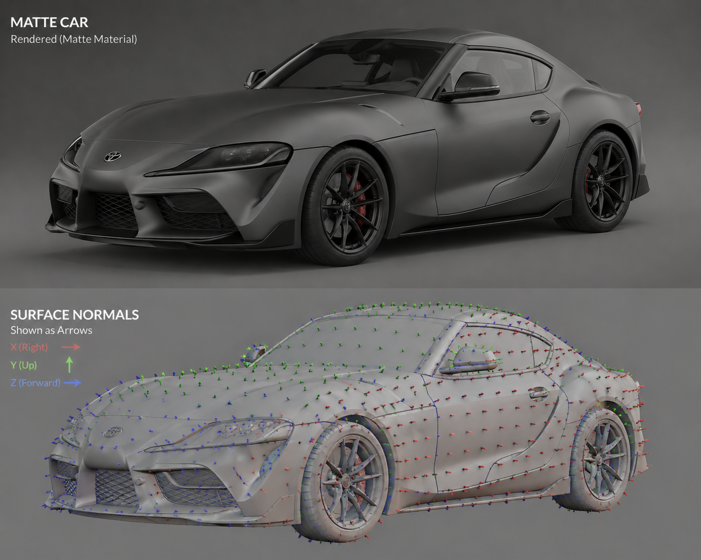
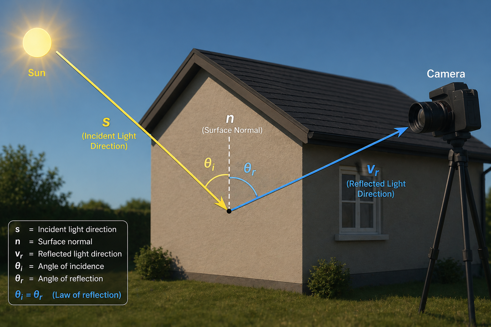

# Radiometry, Reflectance, and Shading

## Overview
Radiometry is the study of electromagnetic waves. In this section we will cover 
a subsection of radiometry, where we use reflectance(how light reflects from objects)
to formulate an equation(a model) for the effects of shading we see in an image.
Shading in an image is what determines the intensity value at a given pixel.
For this section, we will only consider gray level images, which can have intensities
between (0-255).

## Why do we care?
* Shading allows us to uncover **3D geometry from a 2D image**.
* In particular, we will be solving for the **surface normals**, and **albedo**
for an object in an image.
* Surface normals help us figure out the 3D shape of an object in an image

## What Are We Doing?

A **2D image** is a measurement of **light in a scene**(Image Intensity Function).

Image intensity at a pixel depends on: 
- Light source 
- Surface interaction (angle of surface normal and s)
- Reflectiveness of surface(dependent on object material)

-   **Incoming light strength**: $L_i$
-   **Outgoing light strength**: $L_o$

Relationship: - Light comes from all directions - Reflected light
depends on surface properties

## Reflectance and BRDF

**BRDF (Bidirectional Reflectance Distribution Function)** describes how
a material reflects light.

## Lambertian Surface

A **Lambertian surface**: - Reflects light **equally in all
directions** - Example: matte surfaces (e.g., skin, paper)

### Key simplification:

-   BRDF is **constant**
-   Reflection depends only on **albedo** ($\rho$)

## Specular Surface

A **specular surface**: - Reflects light **unevenly** - Example: metal,
mirror

Characteristics: - Mirror: perfectly specular - Light comes in →
reflects in one direction

Makes brdf function a bit more complicated, so we will not cover this here.
If interested in this topic, review slides and textbook material. 

Most objects lie on a spectrum between: - Lambertian (diffuse) -
Specular

In this class: - We **only consider Lambertian surfaces**

## Simplified Model (Lambertian)

We assume: $L_o = L_i * ρ * (s \cdot \hat n)$

Since $L_o$ is porportional to Image Intensity, for the sake of simplicity, we 
will say $L_o$ is approximately equl to our Image Intensity(pixel values measured in image)

Where: 
* ρ = albedo
* s = incident ray from light source
* $\hat n$ = surface normal (unit)
* $L_i$ = strength of s
* $L_o$ = strength of $v_r$

Finally, we will group some of the variables to simplify the equation further:
* $\~{s}=L_i s$
* $g= \rho \hat n $

Final Equation: $L_o=\~{s} \cdot g$ 

## Photometric Stereo Setup

Use: 
- **3 images of the same object(usually a sphere because normals are easy to compute for spheres)** 
- Each image has a **different light source**

Requirement: - Light directions must be **linearly independent in 3D**

### Estimating Light Direction

From each image: 
1. Find centroid ($x_c,y_c$), and radius(R) of sphere.
2. Find the **brightest pixel** in the sphere call it ($x_b,y_b$)
3. Compute the **normal of the sphere at that point**(Assumption: -Orthographic projection). Let:
    * Equation for a sphere: $R^2=(x-x_c)^2+(y-y_c)^2+(z-z_c)^2$, where point (x,y,z) satisfies the equation
    * X=$x_b-x_c$
    * Y=$y_b-y_c$
    * Z=$z_b-z_c$
    * Since we computed the brightest point directly from the sphere, it is    guaranteed, to live on the sphere. Thus: 
    $R^2=(x-x_c)^2+(y-y_c)^2+(z-z_c)^2=R^2=X^2+Y^2+Z^2$
    * Since we know R, X and Y we just have to solve for Z using simple algebra: 
      $Z=\sqrt{R^2-X^2-Y^2}$
    * Finally, we get: $N= \begin{bmatrix} X \\ Y \\ \sqrt{R^2-X^2-Y^2} \end{bmatrix}$
    * Normalize Normal vector to get unit normal: $s= \hat n= \frac{1}{R}\begin{bmatrix} X \\ Y \\ \sqrt{R^2-X^2-Y^2} \end{bmatrix}$
    * Use the pixel value at $(x_b,y_b)=\lambda$ as an approximation of to $L_i$, thus: $\~{s}=\lambda s$
4. Repeat this for each image, to get light the corresponding light source vector: $\~{s}_1,\~{s}_2, \~{s}_3$, and put it together in the s-matrix = $\begin{bmatrix}&\~{s}_1&\\ &\~{s}_2&  \\ &\~{s}_3& \end{bmatrix}$

